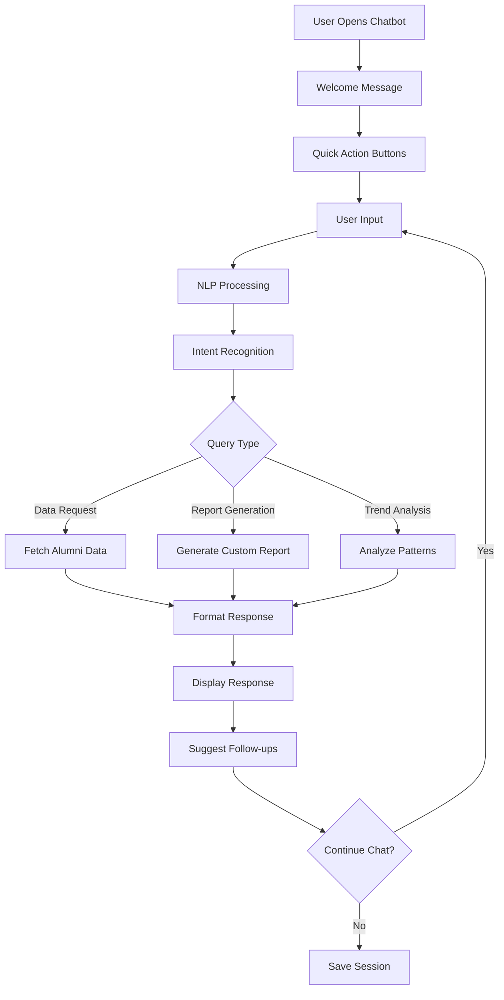

# AI Analytics Chatbot Implementation Document

## 1. Product Overview

The AI Analytics Chatbot is an interactive conversational interface that enhances the existing AI analytics system by allowing users to ask natural language questions about alumni data, request custom insights, and generate reports through chat interactions. This feature transforms static analytics into a dynamic, user-driven experience where administrators and staff can explore data through intuitive conversations.

## 2. Core Features

### 2.1 User Roles

| Role | Access Level | Chat Permissions |
|------|-------------|------------------|
| Admin | Full Access | Can ask any questions, access all data insights, generate comprehensive reports |
| Staff | Limited Access | Can ask basic questions about alumni trends, view standard reports |
| Alumni | Read-Only | Can ask questions about general statistics and public insights |

### 2.2 Feature Modules

Our AI Analytics Chatbot consists of the following main components:

1. **Chat Interface**: Real-time messaging interface, message history, typing indicators, quick action buttons
2. **Natural Language Processing**: Query interpretation, intent recognition, context understanding
3. **Data Query Engine**: Alumni data retrieval, custom report generation, statistical analysis
4. **Response Generation**: Conversational responses, data visualization suggestions, follow-up questions
5. **Chat Management**: Conversation history, session management, export capabilities

### 2.3 Feature Details

| Component | Module | Feature Description |
|-----------|--------|--------------------|
| Chat Interface | Message Display | Real-time chat bubbles with timestamps, user avatars, message status indicators |
| Chat Interface | Input Controls | Text input with send button, voice input support, file attachment for data queries |
| Chat Interface | Quick Actions | Predefined question buttons, report templates, common analytics shortcuts |
| NLP Engine | Query Parser | Parse natural language questions into structured data queries |
| NLP Engine | Intent Recognition | Identify user intent (data request, report generation, trend analysis) |
| NLP Engine | Context Management | Maintain conversation context, handle follow-up questions |
| Data Engine | Alumni Queries | Retrieve specific alumni information, filter by criteria, aggregate statistics |
| Data Engine | Report Generation | Create custom reports based on chat requests, export in multiple formats |
| Data Engine | Trend Analysis | Analyze patterns, compare time periods, identify anomalies |
| Response System | Answer Formatting | Format responses with charts, tables, and visual elements |
| Response System | Suggestion Engine | Provide follow-up questions and related insights |
| Chat Management | History Storage | Save conversation history, search previous chats, bookmark important insights |

## 3. Core Process

### User Interaction Flow

1. **Chat Initiation**: User opens chatbot interface from AI analytics dashboard
2. **Welcome & Context**: Bot greets user and provides quick action suggestions
3. **Query Processing**: User asks question in natural language
4. **Intent Analysis**: System analyzes query and determines data requirements
5. **Data Retrieval**: Backend fetches relevant alumni data
6. **Response Generation**: AI generates conversational response with insights
7. **Follow-up Interaction**: Bot suggests related questions or deeper analysis
8. **Session Management**: Conversation is saved and can be resumed later

### Conversation Flow Diagram



## 4. User Interface Design

### 4.1 Design Style

- **Primary Colors**: #667eea (primary blue), #764ba2 (secondary purple)
- **Chat Bubbles**: Rounded corners (12px), user messages in blue gradient, bot messages in light gray
- **Typography**: Inter font family, 14px for messages, 12px for timestamps
- **Layout**: Fixed chat panel on right side of analytics dashboard, expandable to full screen
- **Icons**: Feather icons for send, attach, voice, with smooth hover animations
- **Animations**: Typing indicators, smooth message transitions, fade-in effects

### 4.2 Chat Interface Components

| Component | Design Specifications |
|-----------|----------------------|
| Chat Header | Purple gradient background, bot avatar, status indicator, minimize/expand buttons |
| Message Area | Scrollable container, auto-scroll to bottom, message grouping by time |
| User Messages | Blue gradient bubbles, right-aligned, sent timestamp, delivery status |
| Bot Messages | Light gray bubbles, left-aligned, bot avatar, typing animation |
| Input Area | Text input with placeholder, send button, attachment icon, voice input |
| Quick Actions | Horizontal scrollable buttons below input, predefined queries |
| Suggestions | Clickable suggestion chips after bot responses |

### 4.3 Responsiveness

The chatbot interface is designed mobile-first with responsive breakpoints:
- **Desktop**: Fixed sidebar panel (400px width) with option to expand to modal
- **Tablet**: Overlay modal covering 70% of screen width
- **Mobile**: Full-screen overlay with optimized touch interactions

## 5. Technical Architecture

### 5.1 Backend Components

**New Service Classes:**
- `AIChatbotService`: Main chatbot logic and conversation management
- `NLPProcessor`: Natural language processing and intent recognition
- `ChatSessionManager`: Handle conversation history and context
- `QueryBuilder`: Convert natural language to database queries

**Enhanced Existing Services:**
- `AIAnalyticsService`: Extended with chatbot integration methods
- Add conversation-based analytics generation
- Support for real-time data queries

### 5.2 Frontend Components

**React Components:**
- `ChatbotWidget`: Main chat interface container
- `MessageBubble`: Individual message display
- `ChatInput`: Message input with attachments
- `QuickActions`: Predefined action buttons
- `TypingIndicator`: Bot typing animation

### 5.3 Database Schema

```sql
-- Chat Sessions Table
CREATE TABLE chat_sessions (
    id UUID PRIMARY KEY DEFAULT gen_random_uuid(),
    user_id UUID REFERENCES users(id),
    session_name VARCHAR(255),
    created_at TIMESTAMP DEFAULT NOW(),
    updated_at TIMESTAMP DEFAULT NOW(),
    is_active BOOLEAN DEFAULT true
);

-- Chat Messages Table
CREATE TABLE chat_messages (
    id UUID PRIMARY KEY DEFAULT gen_random_uuid(),
    session_id UUID REFERENCES chat_sessions(id),
    message_type ENUM('user', 'bot') NOT NULL,
    content TEXT NOT NULL,
    metadata JSONB, -- Store query results, attachments, etc.
    created_at TIMESTAMP DEFAULT NOW()
);

-- Chat Intents Table (for learning)
CREATE TABLE chat_intents (
    id UUID PRIMARY KEY DEFAULT gen_random_uuid(),
    user_query TEXT NOT NULL,
    detected_intent VARCHAR(100),
    confidence_score DECIMAL(3,2),
    successful_response BOOLEAN DEFAULT true,
    created_at TIMESTAMP DEFAULT NOW()
);
```

### 5.4 API Endpoints

```typescript
// Chat Management
POST /api/chat/sessions - Create new chat session
GET /api/chat/sessions - Get user's chat sessions
GET /api/chat/sessions/{id}/messages - Get session messages
DELETE /api/chat/sessions/{id} - Delete chat session

// Message Handling
POST /api/chat/message - Send message and get bot response
POST /api/chat/voice - Process voice input
GET /api/chat/suggestions - Get conversation suggestions

// Data Queries
POST /api/chat/query - Process natural language data query
GET /api/chat/quick-actions - Get predefined quick actions
POST /api/chat/export - Export conversation or generated report
```

## 6. Implementation Phases

### Phase 1: Basic Chat Interface (Week 1-2)
- Create chat UI components
- Implement basic message sending/receiving
- Add conversation history storage
- Integrate with existing authentication

### Phase 2: NLP Integration (Week 3-4)
- Implement intent recognition system
- Create query parsing logic
- Add predefined question templates
- Test with common alumni data queries

### Phase 3: Advanced Features (Week 5-6)
- Add voice input support
- Implement file attachment handling
- Create export functionality
- Add conversation analytics

### Phase 4: AI Enhancement (Week 7-8)
- Integrate with external NLP APIs
- Implement learning from user interactions
- Add personalized suggestions
- Optimize response generation

## 7. Sample Conversation Flows

### Example 1: Basic Data Query
```
User: "How many alumni do we have from the Computer Science program?"
Bot: "I found 245 alumni from the Computer Science program. Here's the breakdown:
     • Bachelor's: 180 alumni
     • Master's: 65 alumni
     
     Would you like to see their employment status or graduation years?"
```

### Example 2: Trend Analysis
```
User: "Show me alumni registration trends for the last 6 months"
Bot: "Here's the alumni registration trend for the last 6 months:
     [Chart showing monthly registrations]
     
     Key insights:
     • Peak registration in March (45 new alumni)
     • Steady growth of 15% month-over-month
     • Engineering programs show highest growth
     
     Would you like to explore specific programs or compare with previous years?"
```

### Example 3: Custom Report Generation
```
User: "Create a report of alumni working in tech companies"
Bot: "I've generated a comprehensive report of alumni in tech companies:
     
     📊 Summary:
     • 156 alumni currently in tech (32% of total)
     • Top companies: Google (12), Microsoft (8), Apple (6)
     • Average salary range: $75K - $120K
     
     The full report includes company breakdown, salary analysis, and geographic distribution. Would you like me to email this report or show specific sections?"
```

## 8. Success Metrics

- **User Engagement**: Chat sessions per user, messages per session
- **Query Success Rate**: Percentage of queries successfully answered
- **Response Time**: Average time to generate responses
- **User Satisfaction**: Feedback ratings on bot responses
- **Feature Adoption**: Usage of different chat features (voice, export, etc.)
- **Data Insights Generated**: Number of custom reports and insights created through chat

## 9. Security Considerations

- **Data Privacy**: Ensure chat conversations don't expose sensitive alumni information
- **Access Control**: Implement role-based restrictions on data access through chat
- **Input Validation**: Sanitize all user inputs to prevent injection attacks
- **Session Security**: Secure chat sessions with proper authentication
- **Audit Trail**: Log all data queries and responses for compliance

## 10. Future Enhancements

- **Multi-language Support**: Support for different languages in chat
- **Advanced Analytics**: Predictive analytics through conversational interface
- **Integration Expansion**: Connect with external systems (CRM, email marketing)
- **Mobile App**: Dedicated mobile app for chatbot interactions
- **Voice Assistant**: Full voice-controlled analytics assistant
- **Collaborative Features**: Share chat insights with team members