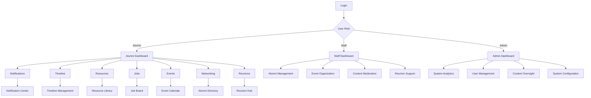

# Product Requirements Document - Alumni Dashboard Enhancement

## 1. Product Overview

The Alumni Dashboard Enhancement project transforms the existing basic alumni management system into a comprehensive, modern platform that facilitates meaningful connections, professional development, and community engagement among alumni, staff, and administrators.

This enhancement addresses the need for better alumni engagement, streamlined communication, professional networking opportunities, and efficient event management. The target users include alumni seeking career growth and networking, staff managing alumni relations, and administrators overseeing the entire system.

The enhanced system aims to increase alumni engagement by 300%, improve job placement rates through the integrated job board, and establish a sustainable platform for long-term alumni relationship management.

## 2. Core Features

### 2.1 User Roles

| Role | Registration Method | Core Permissions |
|------|---------------------|------------------|
| Alumni | Email registration with alumni ID verification | Access all alumni features, create content, network with peers, organize reunions |
| Staff | Admin invitation with role assignment | Manage alumni relations, moderate content, organize institutional events, assist with reunions |
| Admin | System-level access with full privileges | Full system control, user management, analytics access, system configuration |

### 2.2 Feature Module

Our enhanced alumni dashboard consists of the following main feature modules:

1. **Push Notifications System**: Real-time notification delivery, preference management, notification analytics
2. **Feedback System**: Structured feedback collection, response management, feedback analytics
3. **Personal Timeline**: Visual journey tracking, milestone management, privacy controls
4. **Notification Center**: Centralized notification hub, advanced filtering, bulk operations
5. **Professional Development Resources**: Resource library, bookmark system, contribution platform
6. **Job Board**: Job posting platform, application tracking, career matching
7. **Event Calendar**: Event management, registration system, calendar integration
8. **Professional Networking**: Alumni directory, connection system, networking groups
9. **Class Reunion Organizer**: Reunion planning tools, attendee management, activity coordination

### 2.3 Page Details

| Page Name | Module Name | Feature Description |
|-----------|-------------|---------------------|
| Enhanced Dashboard | Dashboard Overview | Display personalized widgets, quick access to all features, activity feed, notification summary |
| Notification Center | Push Notifications | View all notifications with filtering, mark as read/unread, manage notification preferences, notification history |
| Personal Timeline | Timeline Management | Create and view timeline events, add milestones with attachments, privacy settings, export timeline |
| Feedback Portal | Feedback System | Submit feedback with categories and ratings, track feedback status, view admin responses |
| Resource Library | Professional Development | Browse categorized resources, bookmark favorites, submit new resources, rate and review content |
| Job Board | Career Services | Browse job listings with advanced filters, post job opportunities, manage applications, set job alerts |
| Event Calendar | Event Management | View events in calendar format, register for events, create personal events, sync with external calendars |
| Alumni Directory | Professional Networking | Search alumni by various criteria, send connection requests, view professional profiles, join networking groups |
| Reunion Hub | Class Reunion Organizer | Plan and manage reunions, coordinate with committee members, track attendees, manage reunion activities |
| Admin Dashboard | System Management | Comprehensive analytics, user management, content moderation, system configuration |
| Staff Dashboard | Alumni Relations | Manage assigned alumni, organize events, moderate content, track engagement metrics |
| Profile Management | User Profile | Enhanced profile with professional information, privacy settings, notification preferences |

## 3. Core Process

### Alumni User Flow
Alumni users begin their journey on the enhanced dashboard where they can access personalized widgets showing recent notifications, upcoming events, and networking suggestions. They can navigate to the notification center to manage their communications, update their personal timeline with career milestones, browse the resource library for professional development, search and apply for jobs on the job board, register for events, connect with other alumni through the networking features, and organize or participate in class reunions.

### Staff User Flow
Staff members access their specialized dashboard to manage alumni relations, where they can send targeted notifications to alumni groups, organize institutional events, moderate user-generated content, assist with reunion planning, and track engagement metrics. They have enhanced permissions to manage resources, approve job postings, and facilitate networking activities.

### Admin User Flow
Administrators have comprehensive system access through their advanced dashboard, where they can monitor all system activities, manage user accounts and permissions, configure system settings, analyze usage patterns and engagement metrics, moderate all content types, and provide support for both staff and alumni users.

## 4. User Interface Design

### 4.1 Design Style

- **Primary Colors**: Deep blue (#1e40af) for trust and professionalism, complemented by warm orange (#f97316) for engagement
- **Secondary Colors**: Soft gray (#f8fafc) for backgrounds, dark gray (#374151) for text, green (#10b981) for success states
- **Button Style**: Rounded corners with subtle shadows, hover animations, and clear visual hierarchy
- **Typography**: Inter font family with 16px base size, clear hierarchy with 24px headings and 14px secondary text
- **Layout Style**: Card-based design with consistent spacing, responsive grid system, and intuitive navigation
- **Icons**: Heroicons for consistency, with custom illustrations for feature highlights and empty states

### 4.2 Page Design Overview

| Page Name | Module Name | UI Elements |
|-----------|-------------|-------------|
| Enhanced Dashboard | Main Dashboard | Grid layout with customizable widgets, activity feed with infinite scroll, quick action buttons with icons, notification bell with badge count |
| Notification Center | Notifications | List view with categorized tabs, filter dropdown with multiple options, bulk action toolbar, read/unread toggle switches |
| Personal Timeline | Timeline | Vertical timeline with milestone cards, add event modal with form validation, privacy toggle switches, export button with PDF generation |
| Feedback Portal | Feedback | Multi-step form with progress indicator, star rating component, file upload with drag-and-drop, status tracking with color-coded badges |
| Resource Library | Resources | Grid/list view toggle, category sidebar with collapsible sections, search bar with autocomplete, bookmark heart icon with animation |
| Job Board | Jobs | Card-based job listings, advanced filter panel, application modal with form fields, job alert setup with notification preferences |
| Event Calendar | Events | Full calendar view with month/week/day options, event detail modal with registration form, RSVP status indicators, sync calendar button |
| Alumni Directory | Networking | Profile cards with hover effects, advanced search with multiple filters, connection request modal, networking group cards |
| Reunion Hub | Reunions | Planning dashboard with task lists, attendee management table, budget tracker with charts, photo gallery with upload functionality |

### 4.3 Responsiveness

The system is designed with a mobile-first approach, ensuring optimal experience across all devices. The responsive design includes:

- **Desktop (1024px+)**: Full feature access with multi-column layouts and advanced interactions
- **Tablet (768px-1023px)**: Adapted layouts with collapsible sidebars and touch-optimized controls
- **Mobile (320px-767px)**: Simplified navigation with bottom tab bar, swipe gestures, and thumb-friendly touch targets

Touch interaction optimization includes larger tap targets (minimum 44px), swipe gestures for navigation, pull-to-refresh functionality, and haptic feedback for important actions.

## 5. Detailed Feature Specifications

### 5.1 Push Notifications System

**User Stories:**
- As an alumni, I want to receive real-time notifications about events, job postings, and networking opportunities so I can stay engaged with the community
- As a staff member, I want to send targeted notifications to specific alumni groups so I can effectively communicate important information
- As an admin, I want to monitor notification delivery and engagement rates so I can optimize communication strategies

**Functional Requirements:**
- Real-time notification delivery via WebSocket connections
- Notification categorization (announcements, events, jobs, networking, system)
- User preference management with granular controls
- Notification scheduling and bulk sending capabilities
- Delivery tracking and read receipts
- Mobile push notification support

**Acceptance Criteria:**
- Notifications appear within 5 seconds of being sent
- Users can customize notification preferences by category
- Notification history is maintained for 90 days
- Bulk notifications can be sent to up to 1000 users simultaneously

### 5.2 Feedback System

**User Stories:**
- As an alumni, I want to provide feedback about system features and events so I can help improve the platform
- As a staff member, I want to respond to feedback and track resolution status so I can maintain good alumni relations
- As an admin, I want to analyze feedback trends and generate reports so I can make data-driven improvements

**Functional Requirements:**
- Structured feedback forms with categories and ratings
- File attachment support for feedback submissions
- Response threading and status tracking
- Feedback analytics and reporting dashboard
- Automated acknowledgment emails
- Feedback escalation workflows

**Acceptance Criteria:**
- Feedback can be submitted with ratings from 1-5 stars
- Staff responses are delivered within 48 hours
- Feedback analytics show trends over time
- Users receive email notifications for feedback updates

### 5.3 Personal Timeline

**User Stories:**
- As an alumni, I want to create a visual timeline of my career journey so I can showcase my professional growth
- As a staff member, I want to view alumni timelines so I can better understand their career progression
- As an admin, I want to see aggregate timeline data so I can understand alumni career patterns

**Functional Requirements:**
- Visual timeline interface with chronological events
- Multiple event types (academic, professional, personal)
- Privacy controls for timeline visibility
- File attachments for timeline events
- Timeline export functionality
- Milestone templates and suggestions

**Acceptance Criteria:**
- Timeline events can be added with dates, descriptions, and attachments
- Privacy settings allow public, alumni-only, or private visibility
- Timeline can be exported as PDF
- Events are displayed in chronological order with visual indicators

### 5.4 Professional Development Resources

**User Stories:**
- As an alumni, I want to access curated professional development resources so I can advance my career
- As a staff member, I want to contribute and organize resources so I can support alumni career growth
- As an admin, I want to moderate and analyze resource usage so I can ensure quality and relevance

**Functional Requirements:**
- Categorized resource library with search functionality
- Resource submission and approval workflow
- Bookmark and personal collection features
- Resource rating and review system
- Usage analytics and recommendations
- Integration with external learning platforms

**Acceptance Criteria:**
- Resources are organized by category and skill level
- Users can bookmark resources and create personal collections
- Resource submissions require admin approval before publication
- Search functionality returns relevant results within 2 seconds

### 5.5 Job Board

**User Stories:**
- As an alumni, I want to find job opportunities posted by other alumni and companies so I can advance my career
- As a staff member, I want to post institutional job opportunities so I can help alumni find relevant positions
- As an admin, I want to moderate job postings and track placement success so I can maintain platform quality

**Functional Requirements:**
- Job posting creation and management interface
- Advanced search and filtering capabilities
- Application tracking system
- Job alert notifications based on preferences
- Company profile integration
- Application analytics and success tracking

**Acceptance Criteria:**
- Job postings include all required information (title, description, requirements, deadline)
- Users can apply directly through the platform
- Job alerts are sent based on user-defined criteria
- Application status is tracked and communicated to applicants

### 5.6 Event Calendar

**User Stories:**
- As an alumni, I want to view and register for events so I can participate in community activities
- As a staff member, I want to organize and manage events so I can facilitate alumni engagement
- As an admin, I want to oversee all events and analyze attendance patterns so I can optimize event planning

**Functional Requirements:**
- Interactive calendar with multiple view options
- Event creation and registration system
- Automated reminder notifications
- Capacity management and waitlist functionality
- Integration with external calendar applications
- Event analytics and attendance tracking

**Acceptance Criteria:**
- Events display correctly in calendar view with proper time zones
- Registration process is completed within 3 clicks
- Automated reminders are sent 24 hours before events
- Calendar can sync with Google Calendar and Outlook

### 5.7 Professional Networking

**User Stories:**
- As an alumni, I want to connect with other alumni in my field so I can expand my professional network
- As a staff member, I want to facilitate networking opportunities so I can help alumni build valuable connections
- As an admin, I want to monitor networking activity and success rates so I can improve the platform

**Functional Requirements:**
- Alumni directory with advanced search capabilities
- Connection request and messaging system
- Professional profile creation and management
- Networking group formation and management
- Mentorship program integration
- Networking analytics and success metrics

**Acceptance Criteria:**
- Alumni can search by industry, location, graduation year, and skills
- Connection requests include personalized messages
- Professional profiles display current position, skills, and interests
- Networking groups can be created for specific industries or interests

### 5.8 Class Reunion Organizer

**User Stories:**
- As an alumni, I want to organize my class reunion so I can reconnect with former classmates
- As a staff member, I want to support reunion planning so I can facilitate successful alumni gatherings
- As an admin, I want to track reunion activities and provide institutional support so I can strengthen alumni relations

**Functional Requirements:**
- Reunion planning dashboard with task management
- Attendee invitation and RSVP tracking
- Committee member coordination tools
- Budget tracking and expense management
- Photo and memory sharing features
- Integration with event calendar system

**Acceptance Criteria:**
- Reunion organizers can create planning committees with defined roles
- RSVP tracking shows real-time attendance numbers
- Budget tracker maintains running totals of expenses and income
- Photo gallery allows multiple contributors with moderation controls

## 6. Technical Requirements

### 6.1 Performance Requirements
- Page load times under 3 seconds on standard broadband connections
- Real-time notifications delivered within 5 seconds
- Search results returned within 2 seconds
- Support for 1000+ concurrent users
- 99.9% uptime availability

### 6.2 Security Requirements
- Role-based access control with granular permissions
- Data encryption in transit and at rest
- Regular security audits and vulnerability assessments
- GDPR compliance for data protection
- Secure file upload with virus scanning

### 6.3 Compatibility Requirements
- Modern web browsers (Chrome 90+, Firefox 88+, Safari 14+, Edge 90+)
- Mobile responsive design for iOS and Android devices
- Screen reader compatibility for accessibility
- Keyboard navigation support

## 7. Success Metrics

### 7.1 Engagement Metrics
- Daily active users increase by 200%
- Average session duration increase by 150%
- Feature adoption rate above 60% within 3 months
- User retention rate above 80% after 6 months

### 7.2 Functional Metrics
- Job application success rate above 25%
- Event attendance rate above 70%
- Networking connection acceptance rate above 60%
- Feedback response rate above 90%

### 7.3 Technical Metrics
- System uptime above 99.9%
- Average page load time under 3 seconds
- Mobile performance score above 90
- Security incident rate below 0.1%

This comprehensive enhancement will transform the alumni management system into a modern, engaging platform that serves as an excellent capstone project demonstration of full-stack development capabilities, user experience design, and project management skills.