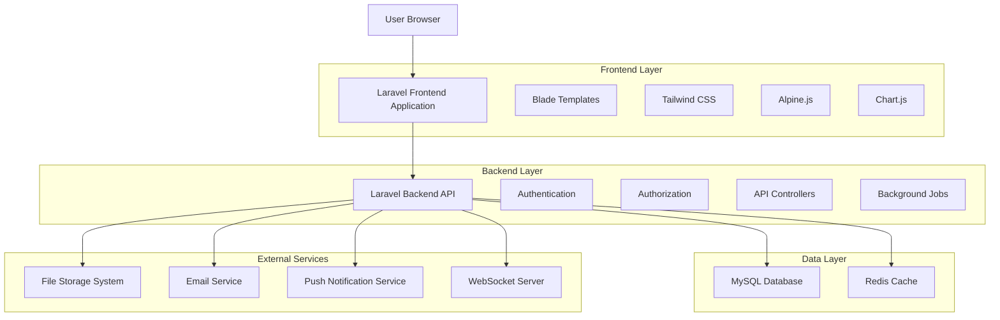
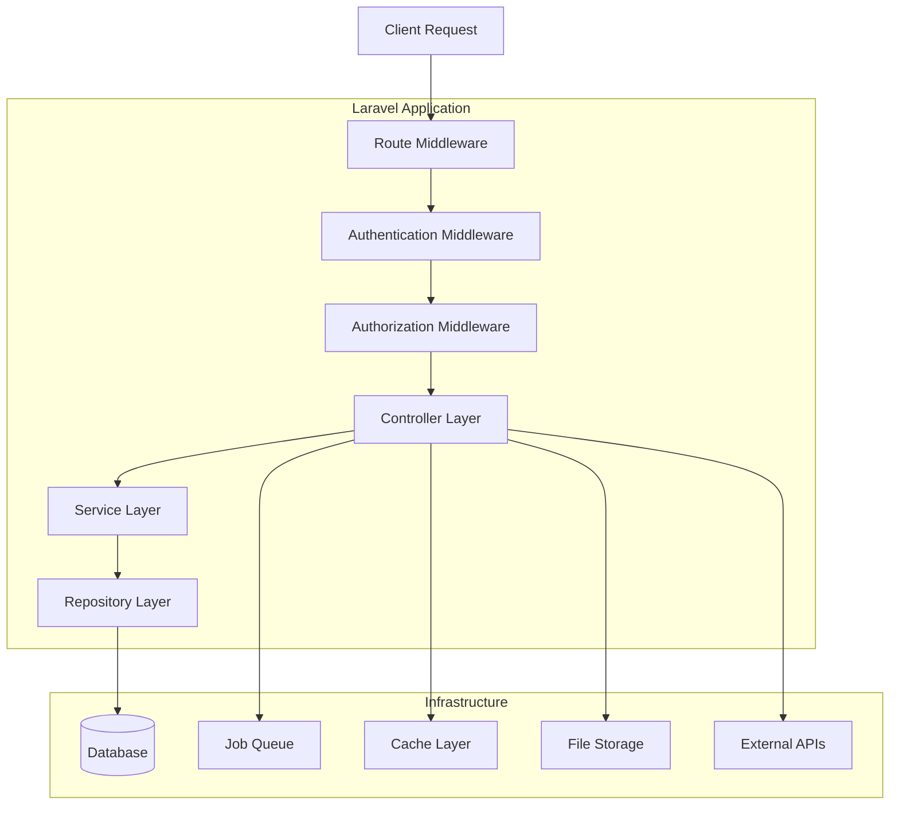
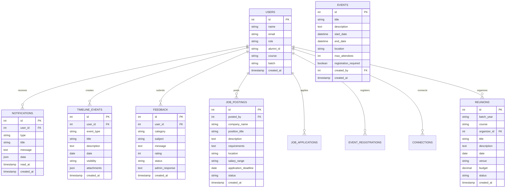

# Technical Architecture Document - Alumni Management System Enhancement

## 1. Architecture Design



## 2. Technology Description

* **Frontend**: Laravel Blade Templates + Tailwind CSS + Alpine.js + Chart.js

* **Backend**: Laravel 11 + PHP 8.2

* **Database**: MySQL 8.0 with Redis for caching

* **Real-time**: Laravel WebSockets + Pusher

* **File Storage**: Laravel Storage with cloud integration

* **Email**: Laravel Mail with queue system

* **Testing**: PHPUnit + Laravel Dusk

## 3. Route Definitions

| Route                | Purpose                                     |
| -------------------- | ------------------------------------------- |
| /user/dashboard      | Enhanced alumni dashboard with new features |
| /user/notifications  | Notification center and preferences         |
| /user/timeline       | Personal timeline management                |
| /user/feedback       | Feedback submission and tracking            |
| /user/resources      | Professional development resources          |
| /user/jobs           | Job board access and applications           |
| /user/events         | Event calendar and registration             |
| /user/networking     | Professional networking features            |
| /user/reunions       | Class reunion organization                  |
| /admin/notifications | Admin notification management               |
| /admin/feedback      | Feedback analytics and responses            |
| /admin/resources     | Resource management and approval            |
| /admin/jobs          | Job posting moderation                      |
| /admin/events        | Event management and analytics              |
| /admin/networking    | Networking oversight and analytics          |
| /admin/reunions      | Reunion support and coordination            |

## 4. API Definitions

### 4.1 Notification System APIs

**Send Notification**

```
POST /api/notifications
```

Request:

| Param Name | Param Type | isRequired | Description          |
| ---------- | ---------- | ---------- | -------------------- |
| user\_ids  | array      | true       | Target user IDs      |
| type       | string     | true       | Notification type    |
| title      | string     | true       | Notification title   |
| message    | string     | true       | Notification content |
| data       | object     | false      | Additional data      |

Response:

| Param Name       | Param Type | Description                  |
| ---------------- | ---------- | ---------------------------- |
| success          | boolean    | Operation status             |
| notification\_id | integer    | Created notification ID      |
| sent\_count      | integer    | Number of notifications sent |

**Get User Notifications**

```
GET /api/user/notifications
```

Response:

| Param Name    | Param Type | Description                   |
| ------------- | ---------- | ----------------------------- |
| notifications | array      | List of notifications         |
| unread\_count | integer    | Count of unread notifications |
| total\_count  | integer    | Total notification count      |

### 4.2 Timeline APIs

**Add Timeline Event**

```
POST /api/timeline/events
```

Request:

| Param Name  | Param Type | isRequired | Description       |
| ----------- | ---------- | ---------- | ----------------- |
| event\_type | string     | true       | Type of event     |
| title       | string     | true       | Event title       |
| description | string     | false      | Event description |
| date        | date       | true       | Event date        |
| visibility  | string     | true       | Privacy setting   |

### 4.3 Job Board APIs

**Create Job Posting**

```
POST /api/jobs
```

Request:

| Param Name            | Param Type | isRequired | Description          |
| --------------------- | ---------- | ---------- | -------------------- |
| company\_name         | string     | true       | Company name         |
| position\_title       | string     | true       | Job position         |
| description           | string     | true       | Job description      |
| requirements          | string     | true       | Job requirements     |
| location              | string     | true       | Job location         |
| salary\_range         | string     | false      | Salary information   |
| application\_deadline | date       | true       | Application deadline |

### 4.4 Event Management APIs

**Create Event**

```
POST /api/events
```

Request:

| Param Name             | Param Type | isRequired | Description              |
| ---------------------- | ---------- | ---------- | ------------------------ |
| title                  | string     | true       | Event title              |
| description            | string     | true       | Event description        |
| start\_date            | datetime   | true       | Event start time         |
| end\_date              | datetime   | true       | Event end time           |
| location               | string     | true       | Event location           |
| max\_attendees         | integer    | false      | Maximum attendees        |
| registration\_required | boolean    | true       | Registration requirement |

## 5. Server Architecture Diagram



## 6. Data Model

### 6.1 Data Model Definition



### 6.2 Data Definition Language

**Notifications Table**

```sql
CREATE TABLE notifications (
    id BIGINT UNSIGNED AUTO_INCREMENT PRIMARY KEY,
    user_id BIGINT UNSIGNED NOT NULL,
    type VARCHAR(255) NOT NULL,
    title VARCHAR(255) NOT NULL,
    message TEXT NOT NULL,
    data JSON NULL,
    read_at TIMESTAMP NULL,
    created_at TIMESTAMP DEFAULT CURRENT_TIMESTAMP,
    updated_at TIMESTAMP DEFAULT CURRENT_TIMESTAMP ON UPDATE CURRENT_TIMESTAMP,
    
    FOREIGN KEY (user_id) REFERENCES users(id) ON DELETE CASCADE,
    INDEX idx_notifications_user_id (user_id),
    INDEX idx_notifications_type (type),
    INDEX idx_notifications_read_at (read_at),
    INDEX idx_notifications_created_at (created_at)
);
```

**Timeline Events Table**

```sql
CREATE TABLE timeline_events (
    id BIGINT UNSIGNED AUTO_INCREMENT PRIMARY KEY,
    user_id BIGINT UNSIGNED NOT NULL,
    event_type VARCHAR(100) NOT NULL,
    title VARCHAR(255) NOT NULL,
    description TEXT NULL,
    date DATE NOT NULL,
    visibility ENUM('public', 'alumni_only', 'private') DEFAULT 'alumni_only',
    attachments JSON NULL,
    created_by BIGINT UNSIGNED NOT NULL,
    created_at TIMESTAMP DEFAULT CURRENT_TIMESTAMP,
    updated_at TIMESTAMP DEFAULT CURRENT_TIMESTAMP ON UPDATE CURRENT_TIMESTAMP,
    
    FOREIGN KEY (user_id) REFERENCES users(id) ON DELETE CASCADE,
    FOREIGN KEY (created_by) REFERENCES users(id) ON DELETE CASCADE,
    INDEX idx_timeline_user_id (user_id),
    INDEX idx_timeline_event_type (event_type),
    INDEX idx_timeline_date (date),
    INDEX idx_timeline_visibility (visibility)
);
```

**Feedback Table**

```sql
CREATE TABLE feedback (
    id BIGINT UNSIGNED AUTO_INCREMENT PRIMARY KEY,
    user_id BIGINT UNSIGNED NOT NULL,
    category VARCHAR(100) NOT NULL,
    subject VARCHAR(255) NOT NULL,
    message TEXT NOT NULL,
    rating TINYINT UNSIGNED NULL CHECK (rating BETWEEN 1 AND 5),
    status ENUM('pending', 'in_review', 'responded', 'closed') DEFAULT 'pending',
    admin_response TEXT NULL,
    staff_id BIGINT UNSIGNED NULL,
    created_at TIMESTAMP DEFAULT CURRENT_TIMESTAMP,
    updated_at TIMESTAMP DEFAULT CURRENT_TIMESTAMP ON UPDATE CURRENT_TIMESTAMP,
    
    FOREIGN KEY (user_id) REFERENCES users(id) ON DELETE CASCADE,
    FOREIGN KEY (staff_id) REFERENCES users(id) ON DELETE SET NULL,
    INDEX idx_feedback_user_id (user_id),
    INDEX idx_feedback_category (category),
    INDEX idx_feedback_status (status),
    INDEX idx_feedback_rating (rating)
);
```

**Job Postings Table**

```sql
CREATE TABLE job_postings (
    id BIGINT UNSIGNED AUTO_INCREMENT PRIMARY KEY,
    posted_by BIGINT UNSIGNED NOT NULL,
    company_name VARCHAR(255) NOT NULL,
    position_title VARCHAR(255) NOT NULL,
    description TEXT NOT NULL,
    requirements TEXT NOT NULL,
    location VARCHAR(255) NOT NULL,
    salary_range VARCHAR(100) NULL,
    job_type ENUM('full_time', 'part_time', 'contract', 'internship') NOT NULL,
    category_id BIGINT UNSIGNED NULL,
    application_deadline DATE NOT NULL,
    status ENUM('active', 'closed', 'draft') DEFAULT 'active',
    view_count INT UNSIGNED DEFAULT 0,
    created_at TIMESTAMP DEFAULT CURRENT_TIMESTAMP,
    updated_at TIMESTAMP DEFAULT CURRENT_TIMESTAMP ON UPDATE CURRENT_TIMESTAMP,
    
    FOREIGN KEY (posted_by) REFERENCES users(id) ON DELETE CASCADE,
    INDEX idx_job_postings_posted_by (posted_by),
    INDEX idx_job_postings_status (status),
    INDEX idx_job_postings_job_type (job_type),
    INDEX idx_job_postings_deadline (application_deadline),
    INDEX idx_job_postings_location (location)
);
```

**Events Table**

```sql
CREATE TABLE events (
    id BIGINT UNSIGNED AUTO_INCREMENT PRIMARY KEY,
    title VARCHAR(255) NOT NULL,
    description TEXT NOT NULL,
    start_date DATETIME NOT NULL,
    end_date DATETIME NOT NULL,
    location VARCHAR(255) NOT NULL,
    event_type ENUM('workshop', 'seminar', 'networking', 'reunion', 'social') NOT NULL,
    category_id BIGINT UNSIGNED NULL,
    max_attendees INT UNSIGNED NULL,
    registration_required BOOLEAN DEFAULT TRUE,
    created_by BIGINT UNSIGNED NOT NULL,
    status ENUM('draft', 'published', 'cancelled', 'completed') DEFAULT 'draft',
    created_at TIMESTAMP DEFAULT CURRENT_TIMESTAMP,
    updated_at TIMESTAMP DEFAULT CURRENT_TIMESTAMP ON UPDATE CURRENT_TIMESTAMP,
    
    FOREIGN KEY (created_by) REFERENCES users(id) ON DELETE CASCADE,
    INDEX idx_events_start_date (start_date),
    INDEX idx_events_event_type (event_type),
    INDEX idx_events_status (status),
    INDEX idx_events_created_by (created_by)
);
```

**Professional Profiles Table**

```sql
CREATE TABLE professional_profiles (
    id BIGINT UNSIGNED AUTO_INCREMENT PRIMARY KEY,
    user_id BIGINT UNSIGNED NOT NULL UNIQUE,
    current_position VARCHAR(255) NULL,
    company VARCHAR(255) NULL,
    industry VARCHAR(100) NULL,
    skills JSON NULL,
    interests JSON NULL,
    linkedin_url VARCHAR(500) NULL,
    available_for_mentoring BOOLEAN DEFAULT FALSE,
    visibility ENUM('public', 'alumni_only', 'private') DEFAULT 'alumni_only',
    created_at TIMESTAMP DEFAULT CURRENT_TIMESTAMP,
    updated_at TIMESTAMP DEFAULT CURRENT_TIMESTAMP ON UPDATE CURRENT_TIMESTAMP,
    
    FOREIGN KEY (user_id) REFERENCES users(id) ON DELETE CASCADE,
    INDEX idx_professional_profiles_industry (industry),
    INDEX idx_professional_profiles_mentoring (available_for_mentoring),
    INDEX idx_professional_profiles_visibility (visibility)
);
```

**Reunions Table**

```sql
CREATE TABLE reunions (
    id BIGINT UNSIGNED AUTO_INCREMENT PRIMARY KEY,
    batch_year VARCHAR(10) NOT NULL,
    course VARCHAR(100) NOT NULL,
    organizer_id BIGINT UNSIGNED NOT NULL,
    title VARCHAR(255) NOT NULL,
    description TEXT NULL,
    date DATE NOT NULL,
    venue VARCHAR(255) NOT NULL,
    budget DECIMAL(10,2) NULL,
    status ENUM('planning', 'published', 'completed', 'cancelled') DEFAULT 'planning',
    attendee_count INT UNSIGNED DEFAULT 0,
    created_at TIMESTAMP DEFAULT CURRENT_TIMESTAMP,
    updated_at TIMESTAMP DEFAULT CURRENT_TIMESTAMP ON UPDATE CURRENT_TIMESTAMP,
    
    FOREIGN KEY (organizer_id) REFERENCES users(id) ON DELETE CASCADE,
    INDEX idx_reunions_batch_year (batch_year),
    INDEX idx_reunions_course (course),
    INDEX idx_reunions_date (date),
    INDEX idx_reunions_status (status)
);
```

**Initial Data Seeding**

```sql
-- Insert notification preferences for existing users
INSERT INTO notification_preferences (user_id, email_notifications, push_notifications, sms_notifications, frequency, categories)
SELECT id, TRUE, TRUE, FALSE, 'immediate', JSON_ARRAY('announcements', 'events', 'jobs')
FROM users;

-- Insert default feedback categories
INSERT INTO feedback_categories (name, description, is_active) VALUES
('System Features', 'Feedback about system functionality and features', TRUE),
('Events', 'Feedback about events and activities', TRUE),
('Job Board', 'Feedback about job postings and career services', TRUE),
('Networking', 'Feedback about networking features and connections', TRUE),
('General', 'General feedback and suggestions', TRUE);

-- Insert default timeline templates
INSERT INTO timeline_templates (name, event_types, is_default) VALUES
('Academic Journey', JSON_ARRAY('graduation', 'academic_achievement', 'certification'), TRUE),
('Professional Growth', JSON_ARRAY('job_change', 'promotion', 'skill_development'), TRUE),
('Personal Milestones', JSON_ARRAY('personal_achievement', 'life_event', 'volunteer_work'), FALSE);
```

